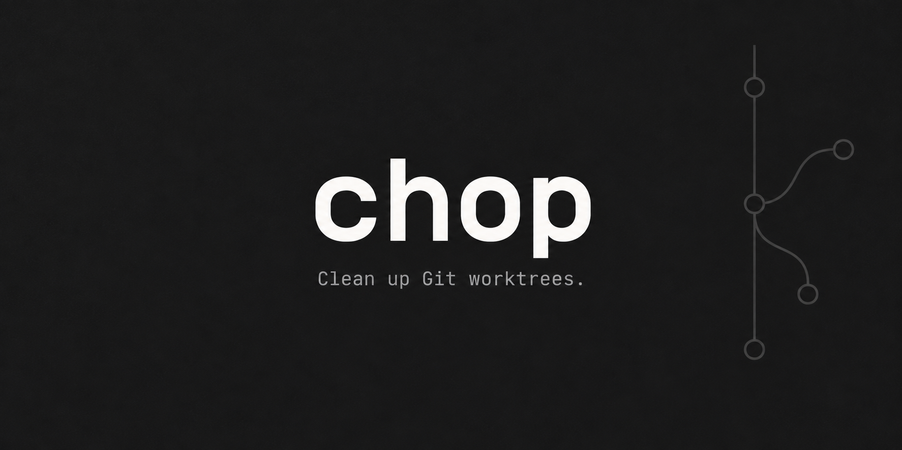
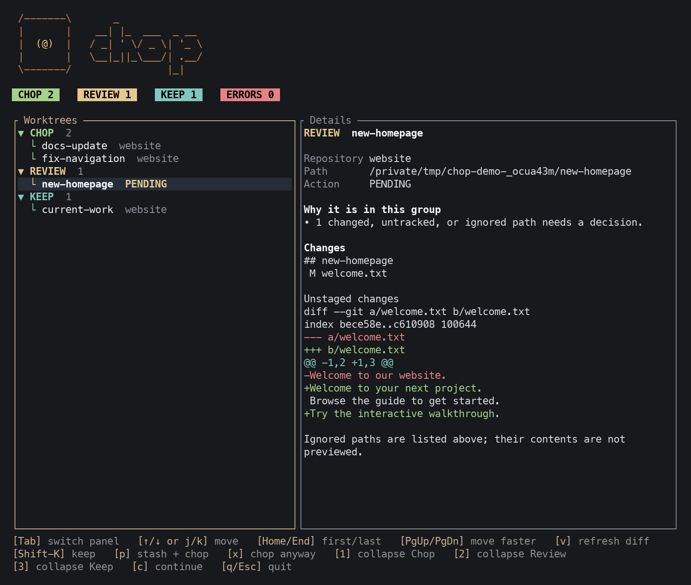

<p align="center">
  
</p>

<h1 align="center">chop</h1>

<p align="center">
  Clean up Git worktrees from your terminal. Review changes, save unfinished work, and confirm what gets removed.
</p>

<p align="center">
  <a href="https://github.com/alberto-castano/chop"></a>
  <a href="https://github.com/alberto-castano/chop/actions"></a>
</p>

<p align="center">
  <a href="#install">Install</a> ·
  <a href="#quick-start">Quick start</a> ·
  <a href="#safety">Safety</a> ·
  <a href="docs/guide.md">Guide</a>
</p>

## Why Chop?

Linked worktrees accumulate as you switch tasks. Chop scans your repository folders and helps you decide which ones to remove.

- **See what needs attention.** Worktrees appear in Chop, Review, or Keep, with a reason for each decision.
- **Inspect changes in place.** Preview staged and unstaged diffs, small untracked files, and a list of ignored paths.
- **Save unfinished work.** Use **stash + chop** to preserve recoverable state before removal, with saved references in the results.
- **Check before removal.** Review the final list, confirm it, and let Chop check each target again.

## Screenshot



*The worktree plan with sample repositories. Select a worktree to inspect its changes before choosing an action.*

## Install

Chop supports **macOS and Linux** and requires **Git**.

```sh
brew install alberto-castano/tap/chop
```

<details>
<summary>Install from source</summary>

With Rust 1.88 or later:

```sh
cargo install --git https://github.com/alberto-castano/chop --locked
```

</details>

For upgrades, see the [installation guide](docs/guide.md#install-and-upgrade).

## Quick start

```sh
chop
```

1. **Choose your repository folders.** On first run, add folders such as `~/repos`. Chop saves them for later runs.
2. **Review the plan.** Select a worktree to see its state and changes. The footer shows available actions.
3. **Choose what to keep or remove.** Resolve Review items, then press `c` to inspect and confirm the final list.

| Group | Meaning |
| --- | --- |
| **Chop** | Clean worktrees, or worktrees you explicitly chose to remove. |
| **Review** | Local files or Git state need your decision. |
| **Keep** | Protected worktrees, or worktrees you chose to keep. |

Main checkouts stay hidden and protected. Use `chop config` to edit your saved repository folders.

To preview without changing configuration or removing worktrees:

```sh
chop all --root ~/repos --dry-run
```

See the [worktree controls](docs/guide.md#use-the-worktree-plan) for navigation, panel focus, and Review actions.

## Safety

> [!WARNING]
> Chop deletes worktree directories. Review the plan and confirmation before you continue.

Chop never removes a repository's main checkout, a bare repository, or the worktree containing your current directory.
It checks each target again before removal and stops if the worktree changed or no longer belongs to the inspected repository.

Clean removal stops for local files, Git operations, nested repositories, and private commits that need protection.
For worktrees in Review, you can:

- **Keep** the worktree.
- **Stash + chop** to save recoverable state using a Git stash and rescue branches when needed.
- **Chop anyway** to remove local state without saving it. This requires typing `CHOP <full-path>` and confirming the final list.

Chop blocks the save action when it cannot preserve the worktree safely.
See [recovery steps](docs/guide.md#stash--chop) before restoring saved work.

Deletion is not secure erase. Backups and filesystem snapshots can keep copies.

## Documentation

The [guide](docs/guide.md) covers the full workflow and command options.

- [Configure repository roots](docs/guide.md#configure-repository-roots)
- [Keyboard and mouse controls](docs/guide.md#use-the-worktree-plan)
- [Save and recover work](docs/guide.md#stash--chop)
- [Preview changes](docs/guide.md#preview-changes)
- [Automation and exit codes](docs/guide.md#use-chop-in-scripts)
- [Troubleshooting](docs/guide.md#troubleshooting)

See the [changelog](CHANGELOG.md) for release history.


## Contributing

Contributions are welcome. See [CONTRIBUTING.md](CONTRIBUTING.md) to get the repo running locally and land a change, and use [issues](https://github.com/a tlberto-castano/chop/issues) and [discussions](https://github.com/alberto-castano/chop/discussions) to collaborate. By participating, you agree to the [Code of Conduct](./CODE_OF_CONDUCT.md).

## License

[MIT](LICENSE)

## Contributors

[](https://github.com/alberto-castano/chop/graphs/contributors)

 Made with [contrib.rocks](https://contrib.rocks)

## Stats


## Star History

<a href="https://www.star-history.com/?repos=alberto-castano%2Fchop&type=date&legend=top-left">
 <picture>
   <source media="(prefers-color-scheme: dark)" srcset="https://api.star-history.com/chart?repos=alberto-castano/chop&type=date&theme=dark&legend=top-left&sealed_token=2BMBPgk0dLlhU5w4CRLlS7fk-9BTzo_UrGZLO2gkeTOGoukYcZCpw6UKjWSLwTWApLI7mHOY_bycA8u9dfhZfva3r-WfHwQ-UO_PPiBptc2uLfauypue61AXhyBT930oge5r3fv3a_v5InHq3WklV1K4zLmmUlCNbNcpdAA1utRF5aDhbyxHm8xFRmNT" />
   <source media="(prefers-color-scheme: light)" srcset="https://api.star-history.com/chart?repos=alberto-castano/chop&type=date&legend=top-left&sealed_token=2BMBPgk0dLlhU5w4CRLlS7fk-9BTzo_UrGZLO2gkeTOGoukYcZCpw6UKjWSLwTWApLI7mHOY_bycA8u9dfhZfva3r-WfHwQ-UO_PPiBptc2uLfauypue61AXhyBT930oge5r3fv3a_v5InHq3WklV1K4zLmmUlCNbNcpdAA1utRF5aDhbyxHm8xFRmNT" />
   
 </picture>
</a>